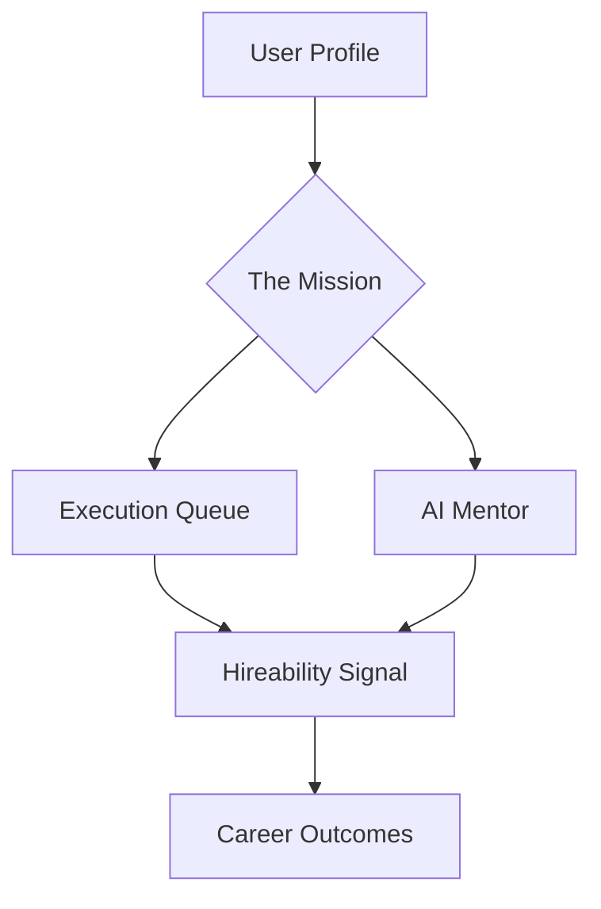

<div align="center">

# 🌌 ELEV8.AI
### The Career Operating System for High-Performance Operators

[]()
[]()
[]()

---

**ELEV8.AI** is a premium, minimalist career execution engine designed to eliminate the noise of job hunting and focus on high-leverage momentum. Inspired by the elegance of Apple and the efficiency of Linear, it transforms your professional journey into a streamlined "Mission" with real-time AI mentoring.

[Deploy to Vercel](https://vercel.com/new) • [View Demo]() • [Report Issue](https://github.com/DevGoyalG/JobGeniusAI/issues)

</div>

---

## 🏛️ System Architecture

ELEV8 is built on a "Mission-First" architecture, moving away from static resume builders toward a dynamic, execution-based workflow.



### 💎 Core Subsystems:
- **Execution Engine**: A high-speed, status-aware task list that prioritizes high-leverage actions.
- **AI Mentor (Live Sync)**: A streaming intelligence layer that provides tactical guidance based on your mission state.
- **Signal Graph**: Real-time visualization of your "Hireability" metrics across industry relevance and execution consistency.

---

## 🎨 Design Philosophy: "Less, but better."

We've completely overhauled the UI/UX to deliver a professional-grade workspace:
- **Invisible UI**: Interfaces that disappear, leaving only your content and focus.
- **Glassmorphism 2.0**: Subtle, multi-layered blur surfaces that feel like physical objects.
- **Fluid Motion**: Powered by **Framer Motion** and **Lenis**, providing native-feel smooth scrolling and micro-interactions (hover-lifts, scale-clicks).
- **Typography-First**: Strict adherence to Inter-Tight with custom tracking for maximum readability on high-density displays.

---

## 🛠️ The Tech Stack

| Layer | Technology |
| :--- | :--- |
| **Framework** | Next.js 15 (App Router), React 19 |
| **Animation** | Framer Motion & Lenis (Smooth Scroll) |
| **Intelligence** | Google Gemini 1.5 Flash / Pro |
| **Database** | Supabase (PostgreSQL) + Drizzle ORM |
| **Styling** | Tailwind CSS (v4 ready) + Shadcn/UI |
| **Auth** | Supabase Auth (Unified Session Management) |

---

## 🚀 Getting Started

### Prerequisites:
- Node.js 18.x or higher
- A Google AI Studio API Key (for Gemini)
- A Supabase Project

### Installation:

1. **Clone & Enter**:
   ```bash
   git clone https://github.com/DevGoyalG/JobGeniusAI.git
   cd JobGeniusAI
   ```

2. **Environment Configuration**:
   Create a `.env.local` file with the following keys:
   ```env
   # Database & Auth (Supabase)
   NEXT_PUBLIC_SUPABASE_URL=your_project_url
   NEXT_PUBLIC_SUPABASE_ANON_KEY=your_anon_key
   SUPABASE_SERVICE_ROLE_KEY=your_service_key

   # AI Intelligence
   GEMINI_API_KEY=your_google_ai_key
   ```

3. **Deploy Locally**:
   ```bash
   npm install --legacy-peer-deps
   npm run dev
   ```

---

## 📐 Implementation Progress

> [!NOTE]
> Currently in **v0.5-beta (Redesign Phase)**. Core layout modules are stabilized.

- [x] **Global Smooth Scroll** (Lenis Integration)
- [x] **Glass Surface System** (Shared UI tokens)
- [x] **AI Mentor Sync** (Streaming responses)
- [x] **Execution Queue** (Priority task management)
- [ ] **Advanced Resume Intelligence** (v0.6)
- [ ] **Mission Analytics** (v0.7)

---

<div align="center">
  <p>Built for the operators. Engineered for the future.</p>
  <a href="https://www.linkedin.com/in/shah-dhruv-/" target="_blank">
    
  </a>
</div>
